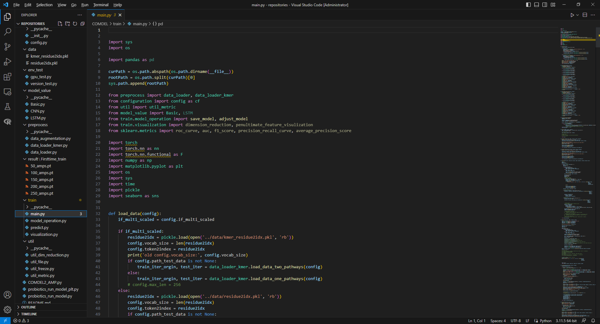

# Lab notebooks  
  
### Lab Notebook: Enhancing Antimicrobial Ability of *Lactobacillus plantarum* Using Deep Learning and Directed Evolution Technologies

#### Project Title
Strengthening the Antimicrobial Ability of *Lactobacillus plantarum* Using Deep Learning and Directed Evolution Technologies

---

### Experiment 1: Deep Learning Model Development

**Objective**:  
Develop a deep learning model based on BiLSTM networks for accurate prediction of bio-functional peptides (BioPeps) across 13 categories, with a focus on antimicrobial peptides (AMPs).

**Materials and Methods**:
1. **Data Collection**:  
   - Compiled a dataset of 17,572 peptide sequences from public databases (e.g., BioPepDB, SATPdb, CancerPPD).
   - Filtered sequences to ensure diversity and quality, removing redundancy and sequences with unusual amino acids.
   
2. **Feature Extraction**:  
   - Employed feature extraction techniques including:
     - Amino Acid Composition (AAC)
     - Dipeptide Composition (DPC)
     - BLOSUM62 embeddings
     - Physicochemical properties from AAindex

3. **Model Architecture**:  
   - Developed three BiLSTM models: BiLSTM, BiLSTM_Attention, and BiLSTM_Predictor.
   - Integrated multiple features and evaluated 2,076 feature combinations for optimal prediction.

4. **Training and Validation**:  
   - Split data into training (80%) and testing (20%) sets.
   - Used Adam optimizer with a learning rate of 0.001.
   - Evaluated model performance using Accuracy, Precision, Sensitivity, and AUROC.

**Results**:  
- Achieved 94.8% accuracy in blinded testing and 88% accuracy in experimental validation for AMP prediction.
- Best performance obtained with BiLSTM_Predictor for AMP, AHP, and DeP categories.

**Conclusion**:  
The developed BiLSTM-based model significantly outperformed existing models in predicting BioPeps, demonstrating strong potential for practical applications.

---

### Experiment 2: Dataset Collection and Processing

**Objective**:  
Curate a comprehensive dataset for BioPeps prediction and refine data quality for improved model training.

**Materials and Methods**:
1. **Data Sources**:  
   - Collected sequences from databases like BioDADPep, CancerPPD, and AHTPDB.
   - Integrated high-throughput AMP-screening data.

2. **Data Curation**:  
   - Removed sequences with over 90% identity to reduce redundancy.
   - Excluded peptides containing non-standard amino acids (e.g., B, J, O, U, X, Z).

3. **Negative Control Selection**:  
   - Selected negative control peptides from UniProt, ensuring similar length distribution to BioPeps.

**Results**:  
- Final dataset: 17,553 peptides, including 13 BioPeps categories and negative controls.
- Successfully balanced dataset to reduce bias in model training.

**Conclusion**:  
The curated dataset provides a robust foundation for training the deep learning model, ensuring high-quality and diverse peptide sequences.

---

### Experiment 3: Cell-Free AMP Synthesis Platform Development

**Objective**:  
Develop a cell-free synthesis platform for rapid and scalable production of AMPs.

**Materials and Methods**:
1. **System Setup**:  
   - Utilized E. coli cell extract-based protein expression system.
   - Prepared a 50 μL reaction mixture containing:
     - 50 mM HEPES buffer (pH 7.2)
     - 1.2 mM ATP, 0.85 mM UTP, GTP, CTP
     - 34 μg/mL folinic acid, 170 μg/mL E. coli tRNA
     - 5 μg/mL T7 RNA Polymerase, 15 μg/mL PCR product
     - 2 mM for each of the 20 amino acids

2. **Reaction Conditions**:  
   - Incubated at 37°C for 4-6 hours.
   - Monitored AMP synthesis using SDS-PAGE and BCA Protein Assay.

3. **Yield Optimization**:  
   - Tested various reaction volumes and component concentrations.
   - Achieved optimal yields of 0.5-2.1 g/L.

**Results**:  
- Successfully produced AMPs in a cell-free system with high yields.
- AMPs exhibited strong antimicrobial activity against target pathogens.

**Conclusion**:  
The cell-free synthesis platform provides a scalable and efficient method for producing AMPs, suitable for industrial applications.

---

### Experiment 4: Directed Evolution of *Lactobacillus plantarum*

**Objective**:  
Enhance the antimicrobial properties of *L. plantarum* through directed evolution and high-throughput screening.

**Materials and Methods**:
1. **Mutagenesis**:  
   - Applied atmospheric and room temperature plasma (ARTP) mutagenesis to generate a diverse mutant library of *L. plantarum*.

2. **Screening**:  
   - Used fluorescence-activated droplet sorting (FADS) to isolate mutants with elevated AMP production.
   - Designed a fluorescence-based sensor system with GFP10-E. coli and GFP11-B. subtilis strains.

3. **Validation**:  
   - Tested isolated mutants against a panel of 7 pathogenic bacteria and fungi.
   - Measured antimicrobial activity and organic acid production.

**Results**:  
- Isolated three mutant strains (M1, M2, M3) with significantly enhanced antimicrobial activity.
- Mutants exhibited up to 2-fold higher bacteriostatic effects compared to the wild-type strain.

**Conclusion**:  
Directed evolution combined with FADS effectively improved *L. plantarum* strains, making them suitable candidates for industrial antimicrobial applications.

---

### Experiment 5: Industrial Application Testing

**Objective**:  
Evaluate the effectiveness of enhanced *L. plantarum* strains in food preservation and pharmaceutical applications.

**Materials and Methods**:
1. **Food Preservation**:  
   - Tested in soy sauce, coconut juice, bread, and lean meats.
   - Monitored microbial growth and product quality over time.

2. **Pharmaceutical Testing**:  
   - Assayed cell-free synthesized AMPs against multi-drug resistant bacteria.
   - Conducted minimum inhibitory concentration (MIC) tests.

**Results**:  
- Enhanced *L. plantarum* strains effectively inhibited spoilage and pathogenic microorganisms in various food matrices.
- Cell-free synthesized AMPs showed potent activity against drug-resistant bacteria.

**Conclusion**:  
The enhanced strains and cell-free AMPs have broad applications in food and pharmaceutical industries, offering natural alternatives to synthetic preservatives and antibiotics.

---

### Notes and Observations
- Continuous optimization of model parameters improved prediction accuracy.
- ARTP mutagenesis was crucial for generating diverse mutants.
- The combination of computational predictions and experimental validation significantly reduced time and cost in identifying effective AMPs.

### Future Directions
1. Expand the dataset to include more diverse BioPeps sequences.
2. Further optimize the cell-free synthesis platform for other peptide categories.
3. Conduct large-scale validation of *L. plantarum* strains in real-world industrial settings.
  
### Experiment record

  
---
