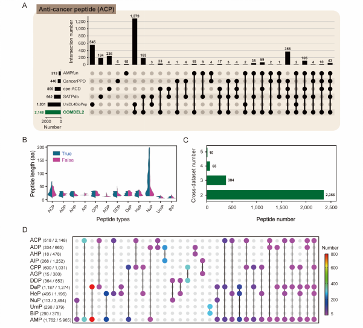
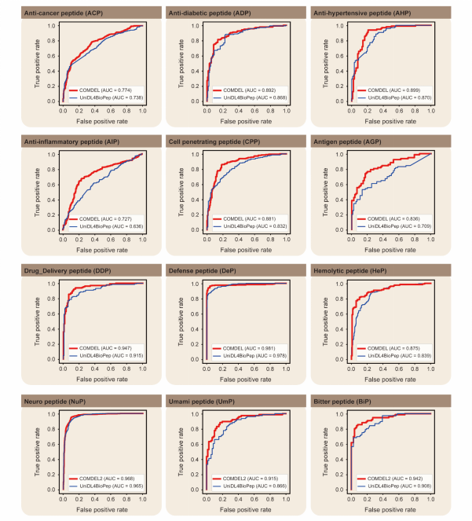

# Protocols  
  
### Protocol: Enhancing Antimicrobial Ability of *Lactobacillus plantarum* Using Deep Learning and Directed Evolution

#### Title
Development and Validation of Enhanced *Lactobacillus plantarum* Strains Using Deep Learning Predictions and Directed Evolution for Antimicrobial Applications

#### Purpose
To develop and validate an advanced deep learning model for predicting bio-functional peptides and to generate enhanced *L. plantarum* strains with superior antimicrobial properties using directed evolution and high-throughput screening techniques.

#### Materials and Reagents

1. **Biological Materials**
   - *Lactobacillus plantarum* wild-type strain
   - E. coli BL21(DE3) strain
   - B. subtilis 168 strain
   - Plasmid pBAD18-GFP

2. **Reagents**
   - Atmospheric and Room Temperature Plasma (ARTP) mutagenesis system
   - Arabinose, L-arabinose
   - S30 buffer: 10 mM triacetate (pH 8.2), 14 mM magnesium acetate, 60 mM potassium acetate, 2 mM dithiothreitol (DTT)
   - HEPES buffer (pH 7.2), folinic acid, E. coli tRNA mixture
   - T7 RNA polymerase
   - Amino acid mix (20 standard amino acids)
   - Nicotinamide adenine dinucleotide (NAD), coenzyme-A (CoA), putrescine, sodium oxalate, spermidine, phosphoenolpyruvate (PEP)
   - BCA Protein Assay Kit
   - SDS-PAGE reagents
   - MRS medium (for *L. plantarum* culture)
   - PBS buffer
   - Antibiotics: Ampicillin
   - Fluorescence-activated droplet sorting (FADS) reagents and microfluidic chips
   - Protease K

3. **Equipment**
   - BiLSTM deep learning model setup (Python, PyTorch)
   - Centrifuge
   - Incubator
   - Sonicator
   - Illumina NovaSeq 6000 platform for next-generation sequencing
   - SDS-PAGE gel electrophoresis setup
   - Fluorescence microscope
   - Electroporator
   - High-speed digital camera for FADS analysis
   - Spectrophotometer

#### Protocol Steps

#### 1. **Data Preparation for Deep Learning Model**

1.1 **Data Collection**:
   - Collect peptide sequences from public databases (BioDADPep, SATPdb, CancerPPD).
   - Ensure the dataset includes various BioPeps categories: AMPs, AIPs, ACPs, etc.

1.2 **Data Processing**:
   - Remove redundant sequences (over 90% identity) using CD-HIT.
   - Exclude sequences containing non-standard amino acids (e.g., B, J, O, U, X, Z).
   - Generate negative control datasets from the UniProt database with similar length distribution.

1.3 **Feature Extraction**:
   - Apply feature extraction techniques such as Amino Acid Composition (AAC), Dipeptide Composition (DPC), and BLOSUM62 embeddings.
   - Use AAindex for physicochemical properties and CKSAAGP for k-spaced amino acid pairs.

1.4 **Model Training**:
   - Train the BiLSTM model on the processed dataset using a split of 80% training and 20% testing data.
   - Optimize model parameters using the Adam optimizer with a learning rate of 0.001.
   - Evaluate the model performance using Accuracy, Sensitivity, Specificity, and AUROC metrics.

#### 2. **Cell-Free AMP Synthesis**

2.1 **Preparation of Cell-Free Extract**:
   - Grow E. coli BL21(DE3) cells to an OD600 of 3 in 2 × YT medium.
   - Harvest cells by centrifugation at 5,000 × g, wash with S30 buffer, and resuspend in fresh S30 buffer.
   - Lyse cells using sonication under ice bath conditions, add DTT, and centrifuge at 12,000 × g for 10 minutes.

2.2 **Cell-Free Reaction Setup**:
   - In a 50 μL reaction volume, mix:
     - 50 mM HEPES buffer (pH 7.2)
     - 1.2 mM ATP, 0.85 mM UTP, GTP, and CTP
     - 34 μg/mL folinic acid, 170 μg/mL E. coli tRNA
     - 5 μg/mL T7 RNA polymerase
     - 15 μg/mL PCR product (peptide template)
     - 2 mM of each of the 20 standard amino acids
     - 0.33 mM NAD, 0.27 mM CoA, 1 mM putrescine, 4 mM sodium oxalate, 1.5 mM spermidine
     - 130 mM potassium glutamate, 10 mM ammonium glutamate, 12 mM magnesium glutamate, 33 mM PEP
     - 30% (v/v) cell extract

2.3 **AMP Production**:
   - Incubate the reaction mixture at 37°C for 4-6 hours.
   - Analyze AMP production using SDS-PAGE and quantify with BCA Protein Assay.

#### 3. **Directed Evolution of *L. plantarum***

3.1 **ARTP Mutagenesis**:
   - Grow *L. plantarum* to OD600 0.6 in MRS medium.
   - Harvest cells, wash twice with PBS buffer, and resuspend in PBS.
   - Expose cell suspension to ARTP treatment: 120 W, 15 SLM, 2 mm, 1 min.

3.2 **Screening with FADS**:
   - Prepare fluorescence-based biosensor strains (GFP10-E. coli, GFP11-B. subtilis).
   - Mix mutant *L. plantarum* library with biosensor strains in microfluidic droplets.
   - Sort droplets based on fluorescence intensity using FADS.

3.3 **Validation of Mutants**:
   - Grow sorted *L. plantarum* mutants and test fermentation products for antimicrobial activity against indicator strains.
   - Use MIC assays to evaluate AMP activity.

#### 4. **Industrial Application Testing**

4.1 **Food Preservation Testing**:
   - Add 5% fermentation supernatant of evolved *L. plantarum* strains to food samples (e.g., soy sauce, coconut juice, bread).
   - Store under standard conditions and monitor microbial growth over time.

4.2 **Pharmaceutical Application Testing**:
   - Test cell-free synthesized AMPs against multi-drug resistant bacteria.
   - Perform MIC tests and assess antimicrobial efficacy.
  
---

| Experiment ID | Objective                                   | Outcome                                          | Figure |
| ------------- | ------------------------------------------- | ------------------------------------------------ | ------ |
| 1             | [Develop BiLSTM-based deep learning model](./experiment_record/COMDEL_1_N_2_repo.png)    | Achieved 94.8% accuracy                          | 3      |
| 2             | Curate peptide dataset                      | Compiled 17,572 unique sequences                 | 1, 4   |
| 3             | Feature extraction for peptides             | Used AAC, DPC, and BLOSUM62 embeddings           | 1      |
| 4             | [AMP prediction validation](./experiment_record/circular_heatmap.png)                   | 88% accuracy in experimental validation          | 5      |
| 5             | Create cell-free AMP synthesis platform     | Produced 0.5-2.1 g/L AMP                         | 6      |
| 6             | Apply ARTP mutagenesis on *L. plantarum*    | Generated diverse mutant strains                 | 7      |
| 7             | Screen mutants with FADS                    | Isolated 3 mutant strains with improved activity | 6      |
| 8             | Test mutants for antimicrobial activity     | Broad-spectrum activity validated                | 7      |
| 9             | Industrial application in food preservation | Increased shelf life of products                 | \#     |
| 10            | Pharmaceutical testing of AMPs              | Effective against multi-drug resistant bacteria  | \#     |
| 11            | Expand dataset for model improvement        | Aimed to improve generalization                  | \#     |
| 12            | Develop *L. plantarum* bio-preservative     | Enhanced probiotic strain for industry           | 7      |

---  

  
**Figure 1. COMDEL application**

---

  
**Figure 2. BioPeps analysis**
  
---

  
**Figure 3. Model construction**

---

  
**Figure 4. Performance evaluation**

---

  
**Figure 5. Application of COMDEL on probiotics and medicinal herbs**

---

  
**Figure 6. COMDEL and FADS application**

---

  
**Figure 7. Antimicrobial activity test**
  

---

